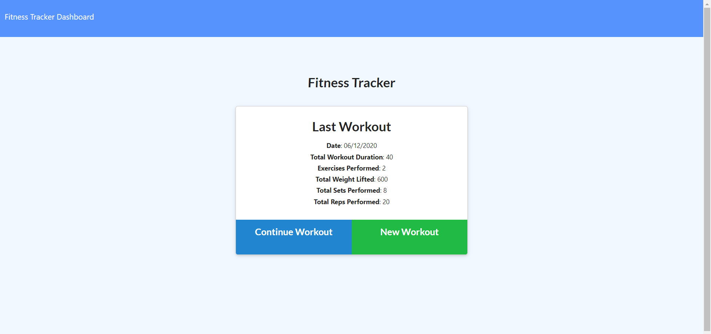
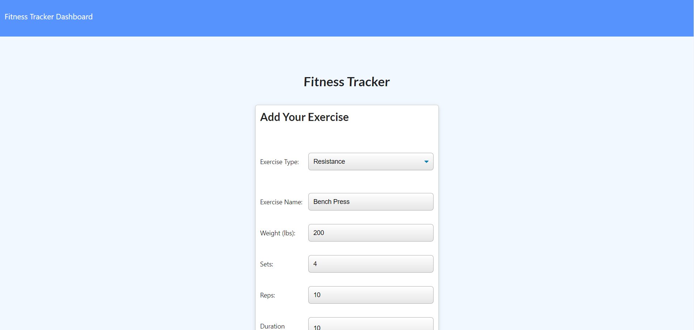
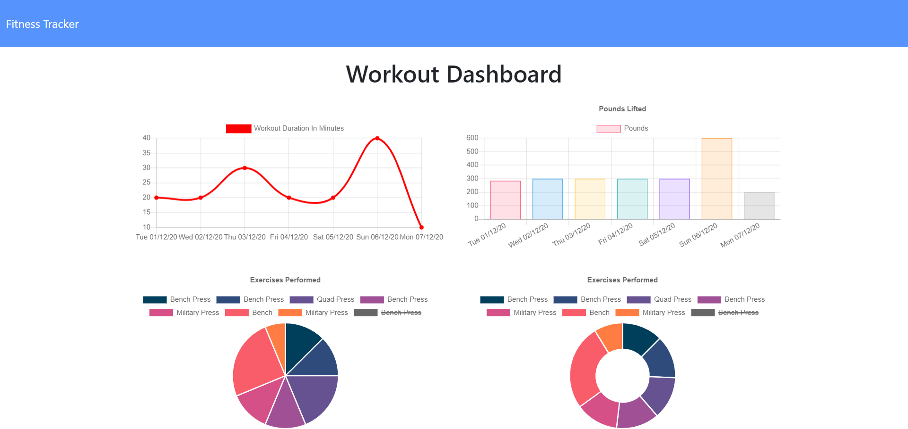

# Workout Tracker

   

## Description 

A fully responsive full-stack web application that allows the user to log either cardio or resistance exercises they have completed during each workout. Users can log multiple workouts in a day and can log multiple exercises per workout. The front end utilises HTML, CSS, JavaScript, jQuery and Bootstrap. The back end utilises Node.js, Express.js and MongoDB & Mongoose for the data storage.

The home page displays the last workout the user logged and displays the total time duration of the workout and also the total weight lifted if there were any resistance exercises in the workout. The user is given the choice of either continuing the workout or starting a new workout. If the user chooses to continue the workout then they are presented with the add new exercise form where they can choose whether to add a cardio or resistance exercise. Cardio exercises have distance and duration fields. Resistance exercises have weight, sets, reps and duration fields. After the user completes the form then they can add the exercise to the workout and continue with another exercise or they can complete the workout and finish the exercises.

After completing the workout users can view the dashboard where they are presented with graphs and charts of their workouts from the last 7 days. There is a line graph that shows the total durations of the workouts per day and there is a bar chart the shows the total weight lifted per day if there were any resistance exercises added.

Then below the graphs are pie charts of the different exercises the user has completed over the last week. Graphs and charts are generated with node package Chart.js.

## Technologies Used

- HTML
- CSS
- JavaScript
- jQuery
- Bootstrap
- Node.js
- Express.js
- MongoDB
- Mongoose
- Chart.js

## Deployed Link

https://protected-eyrie-04466.herokuapp.com/

## Screenshots

###### Welcome Page

###### Add Exercise Form

###### Dashboard Charts

## Contact

Got any questions? Please contact me at tmhaigh@gmail.com
View my online portfolio https://conanas.github.io/
View my LinkedIn https://www.linkedin.com/in/thomas-m-haigh/